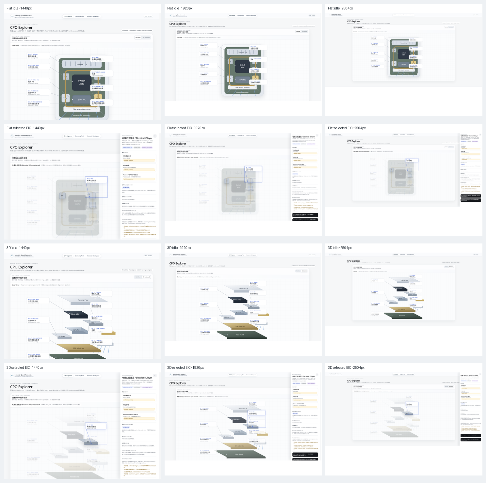
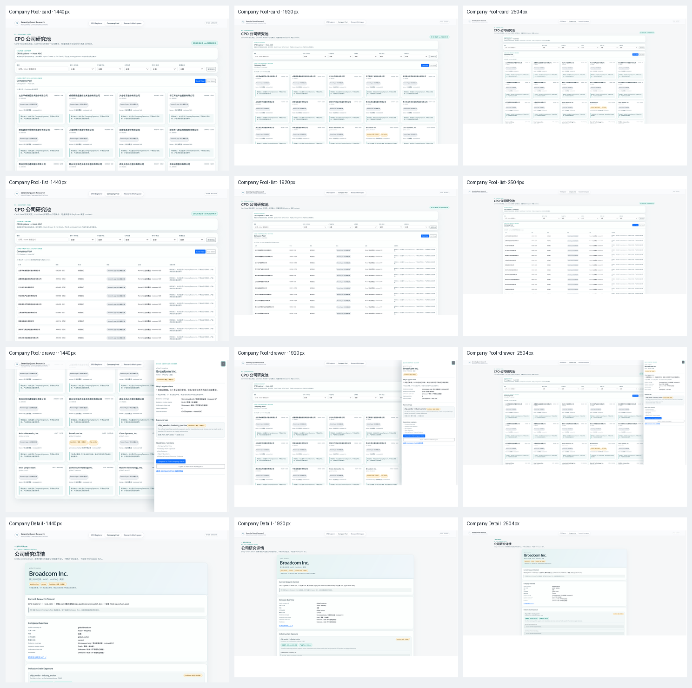
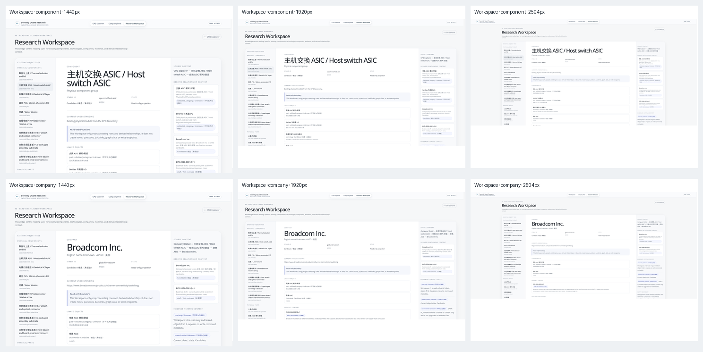

# Research UI Visual Audit

## Metadata

- Project: serenity_quant_research
- Task: Research-facing UI visual audit and repair-session evidence
- Timestamp (UTC): 2026-08-30T12:24:55Z
- Owner: project owner
- Route: review-only
- Source of truth: AGENTS.md

## Status

- Audit disposition: `changes requested`
- Candidate edits: none；本次只做视觉巡检、截图取证和问题整理
- Audit surfaces: CPO Explorer、Company Pool、Quick Company Drawer、Full Company Detail、Research Workspace
- Viewports: `1440×980`、`1920×1080`、`2504×1178`
- Repair boundary: 后续单独 Session 处理；本报告不授权业务代码修改

## Evidence Layout

本目录作为单独的视觉巡检 evidence bundle：

```text
operations/reviews/2026-08-30-research-ui-visual-audit/
├── 2026-08-30-research-ui-visual-audit-review.md
├── 2026-08-31-frontend-upgrade-and-repair-prep-review.md
├── browser-measurements.json
├── contact-sheet-cpo.png
├── contact-sheet-company.png
├── contact-sheet-workspace.png
└── screenshots/
    └── 30 张原始 viewport 截图
```

截图来自本地实际浏览器渲染与交互，不是仅根据静态代码推断。Company Detail / Workspace 使用当前 worktree build 和临时隔离数据库；CPO / Company Pool 使用当前本地 research app。截图只用于 UI/UX 判断，不新增或核验 research facts。

补充 repair-preparation addendum：[`2026-08-31-frontend-upgrade-and-repair-prep-review.md`](2026-08-31-frontend-upgrade-and-repair-prep-review.md)。其中记录 Owner 接受的前端升级方向：research-facing UI 可渐进迁移到 React + Vite，学习 Vibe-Research 的工程架构，但不照搬其视觉主题、heavy sidebar 或 information architecture。

## Executive Summary

Owner 提供的三个例子均成立，并且不是孤立缺陷：当前 research-facing UI 在 viewport 适配、标注构图、selected-state 重排、drawer 与 shell 的关系、跨页面视觉连续性方面缺少统一布局模型。

最需要优先修复的是 CPO Explorer：

1. 固定 `1080×720` SVG 与 `650–760px` stage 高度使主图在宽屏上基本停止增长；
2. 右侧 callout 没有独立 annotation gutter，直接覆盖主体；
3. selected state 使用 fixed drawer + 固定 `scale(.94)`，没有按剩余空间重新居中；
4. SVG group 的 focus outline 形成大面积空心矩形；
5. 非选中对象被过度 blur / dim，空间关系接近消失。

Company 和 Workspace 也复用了“固定最大宽度 + full-height fixed drawer / 多层 boxed section”的方式，因此三个 primary product areas 尚未形成同一套可预测的视觉与响应式系统。

## Contact Sheets

### CPO Explorer



### Company Research



### Research Workspace



## Findings

### V-001 — 主画布和页面宽度存在响应式增长平台

- Severity: High
- Type: visual / responsive layout
- Surfaces: CPO Explorer；并延伸到 Company Detail 与 Workspace 的超宽屏表现

CPO 两个 scene 均使用固定 `viewBox="0 0 1080 720"`，stage 使用：

```css
height: min(74vh, 760px);
min-height: 650px;
```

实测 CPO：

| viewport | canvas | SVG scale |
|---|---:|---:|
| 1440×980 | 约 1311×725 | 1.0072 |
| 1920×1080 | 约 1638×760 | 1.0556 |
| 2504×1178 | 约 1638×760 | 1.0556 |

1920 与 2504 下主图尺寸完全停止增长。2504 宽屏中，实际 3:2 图形约为 `1140×760`，画布内部与页面外部同时出现大量留白。

跨页面还存在不一致的 max-width：

- research shell: `1920px`
- CPO workbench: `1640px`
- Company Pool: `1600px`
- Company Detail: `1180px`
- Workspace: 随 shell 扩展至约 `1803px`

这使页面切换时视觉尺度和内容密度明显跳变。

Evidence:

- [CPO Flat 1440](screenshots/cpo-flat-idle-1440.png)
- [CPO Flat 2504](screenshots/cpo-flat-idle-2504.png)
- [Company Detail 2504](screenshots/company-detail-2504.png)
- [Workspace component 2504](screenshots/workspace-component-2504.png)

Repair acceptance:

- 明确 1440、1920、ultrawide 三档内容策略；
- 主图按可用 content area 调整，而不是只受固定高度控制；
- 保持合理阅读宽度时，也要避免整页视觉对象缩成中央小岛；
- 不以 `<900px` 强制 `min-width: 900px` + 横向滚动作为唯一适配方案。

### V-002 — CPO 右侧 callout 覆盖主图且左右不对称

- Severity: High
- Type: visual hierarchy / composition
- Surfaces: Flat View、3D Exploded View

Flat View 中设备主体约位于 `x=298–784`，右侧 callout 位于 `x=618–828`，与主体重叠约 `166px`；左侧 callout 位于 `x=36–250`，与主体仍有间距。

3D View 同样把右侧 callout 固定在主体范围内。卡片节点又位于组件 DOM 之后，因此总是绘制在组件上方。

Evidence:

- [Flat idle 1440](screenshots/cpo-flat-idle-1440.png)
- [3D idle 1440](screenshots/cpo-three-idle-1440.png)
- [Flat idle 1920](screenshots/cpo-flat-idle-1920.png)
- [3D idle 1920](screenshots/cpo-three-idle-1920.png)

Repair acceptance:

- 划分独立的左 annotation gutter、main geometry safe area、右 annotation gutter；
- callout card 不覆盖主要组件几何；
- 仅 connector line 可跨越安全区；
- Flat / 3D 分别排布，不机械共享视觉坐标策略；
- 左右视觉距离平衡，但不要求数学镜像。

### V-003 — CPO selected state 没有基于 drawer 后剩余空间重排

- Severity: High
- Type: core interaction state / layout
- Surfaces: Flat selected、3D selected

CPO drawer 使用 `position: fixed; top: 0; right: 0; bottom: 0`，不参与 shell 或 workbench 布局。主页面仍按完整 viewport 居中，只将 stage 固定缩小为 `scale(.94)`。

结果包括：

- drawer 覆盖 topbar，并形成“另一个页面压在当前页面上”的感觉；
- workbench 没有以 drawer 左侧剩余区域为中心；
- 1440 下 drawer 占据明显比例，主图与 drawer 竞争；
- 2504 下 workbench 左右留白严重不等；
- selected callout 原有遮挡进一步放大。

Evidence:

- [Flat selected 1440](screenshots/cpo-flat-selected-eic-1440.png)
- [Flat selected 2504](screenshots/cpo-flat-selected-eic-2504.png)
- [3D selected 1440](screenshots/cpo-three-selected-eic-1440.png)
- [3D selected 2504](screenshots/cpo-three-selected-eic-2504.png)

Repair acceptance:

- drawer 应与 research shell / Explorer workbench 建立明确层级；
- 主图按 `available width = viewport/workbench - drawer` 重新定位；
- cinematic re-centering 根据当前 viewport、drawer 宽度和选中 geometry 计算；
- topbar 不应被 contextual drawer 截断；
- 关闭 drawer 后恢复完全一致的 idle geometry。

### V-004 — SVG callout focus outline 产生异常大矩形

- Severity: High
- Type: interaction / accessibility visual defect
- Surfaces: Flat selected、3D selected

`.cpo-callout:focus-visible` 的 outline 直接应用于包含 card、connector line、anchor dot 的完整 SVG `<g>`。浏览器按 group 包围盒绘制 outline，形成覆盖大块空白区域的矩形。

这不是合理的 selected 边界，也不是可接受的键盘 focus 表达。

Evidence:

- [Flat selected EIC 1440](screenshots/cpo-flat-selected-eic-1440.png)
- [3D selected EIC 1920](screenshots/cpo-three-selected-eic-1920.png)

Repair acceptance:

- focus indication 应落在可识别的 card 或真实 component geometry 上；
- connector 不应扩大 focus 包围盒；
- keyboard focus 必须清楚，但不能制造与对象无关的大矩形。

### V-005 — CPO selected state 弱化过度，空间上下文几乎消失

- Severity: High
- Type: visual hierarchy / interaction feedback
- Surfaces: Flat selected、3D selected

当前 unrelated objects 使用：

```css
opacity: .22;
filter: blur(1.2px) saturate(.68);
```

context assembly 进一步降至 `opacity: .32` 并使用 `blur(1.8px)`。selected 后完整设备结构几乎消失，只剩 active card、局部 geometry 和高密度 drawer。

这与 Explorer 需要维持物理空间关系的目标冲突。

Repair acceptance:

- 保留足够的设备轮廓和层级关系；
- 使用对比、清晰度和有限 opacity 差异建立 focus；
- 不让整张研究图退化为不可辨识的灰色背景。

### V-006 — Company Pool 默认视图接近筛选面板 + 重复空状态卡片墙

- Severity: Medium
- Type: product visual hierarchy / information density
- Surfaces: Company Pool Card View

默认页面同时暴露 search、部件/材料组、产业链节点、公司角色、市场/地区、暴露状态和清除动作。筛选层与 context ribbon、panel heading、status line 连续堆叠，首屏在进入公司对象前先经过多层控制区。

20 张公司卡中，大量卡片展示相同的 `Research gap / 尚无暴露记录` 和相似说明，造成重复的低价值视觉墙；真正具有 candidate exposure 的对象缺少足够的扫描优先级。

Evidence:

- [Company Pool card 1440](screenshots/company-pool-card-1440.png)
- [Company Pool card 1920](screenshots/company-pool-card-1920.png)
- [Company Pool card 2504](screenshots/company-pool-card-2504.png)

Repair acceptance:

- 首屏只保留最高价值的 lightweight filters；
- context-derived filters 与手动 filters 区分；
- 无 exposure / 无 evidence 对象使用更紧凑、可分组或低层级表达；
- candidate / verified / gap 对象应能快速扫描，而不是仅靠小 badge 区分。

### V-007 — Quick Company Drawer 重复 full-height overlay 构图问题

- Severity: Medium
- Type: drawer composition / cross-page consistency
- Surfaces: Company Pool Quick Drawer

Quick Company Drawer 使用 `position: fixed; top: 0; height: 100vh; width: 470px; z-index: 1055`。它同样覆盖 topbar，背景公司卡保持高对比且在边界处被硬裁切。

Drawer 内 identity、summary、metrics、exposure、quick links 和 actions 纵向堆叠，但背景仍保持可操作感，前后层级不够明确。

Evidence:

- [Company drawer 1440](screenshots/company-pool-drawer-1440.png)
- [Company drawer 1920](screenshots/company-pool-drawer-1920.png)
- [Company drawer 2504](screenshots/company-pool-drawer-2504.png)

Repair acceptance:

- 与 CPO drawer 使用统一 shell/drawer 层级模型；
- 保留 Pool context，但明确 foreground / background 层级；
- topbar 不被截断；
- selected company 与 drawer identity 保持可追踪关系；
- drawer 内容按 triage 目标收敛，不变成窄版 Full Detail。

### V-008 — Company Detail 过度 boxed，hero 与正文密度失衡

- Severity: Medium
- Type: visual hierarchy / long-form reading
- Surfaces: Full Company Detail

Company Detail 固定 `max-width: 1180px`。在 2504 下仍保持 1180px，形成中央窄岛。页面又将外层 detail content、header 和几乎每个 section 都处理为圆角、边框、阴影容器。

首个 hero 使用很大浅色区域，但身份信息集中在左侧小区域；随后各 section 重复 boxed treatment，连续阅读被切成一组 dashboard cards。

实测页面主体高度约 `1971px`，首屏仍主要用于 hero、context 和 overview，研究内容推进较慢。

Evidence:

- [Company Detail 1440](screenshots/company-detail-1440.png)
- [Company Detail 1920](screenshots/company-detail-1920.png)
- [Company Detail 2504](screenshots/company-detail-2504.png)

Repair acceptance:

- 保持适合阅读的行宽，但避免超宽屏中央小岛；
- 降低 hero 空白和装饰面积；
- 使用文档式 section rhythm、divider 和 typography，减少每节独立 card；
- 首屏更快到达 company context 与关键 evidence 状态。

### V-009 — Workspace 中心阅读面被两侧高密度 rail 竞争

- Severity: Medium
- Type: knowledge-workspace hierarchy / layout
- Surfaces: Component Workspace、Company Workspace

Workspace 在 1440 下采用约 `260px / flexible / 320px` 三栏：

- 左侧树包含大量双语长标签；
- 中心使用超大双语标题；
- 右侧将 relationship、company、evidence 等再次拆成多张 card；
- 三栏同时使用较多 borders、pills 和 nested cards。

右侧 context rail 没有保持足够克制，和中心 reading area 争夺注意力。左、右 rail 设置了 `overflow: auto`，但父 grid 没有 viewport 高度约束；实测 Workspace app 高约 `2408px`，side rails 被拉伸到完整正文高度，而不是形成有效的 sticky / independent-scroll context。

Evidence:

- [Workspace component 1440](screenshots/workspace-component-1440.png)
- [Workspace component 1920](screenshots/workspace-component-1920.png)
- [Workspace company 1440](screenshots/workspace-company-1440.png)
- [Workspace company 2504](screenshots/workspace-company-2504.png)
- [Browser measurements](browser-measurements.json)

Repair acceptance:

- 中心 current object 保持明确的第一视觉层级；
- 左树和右 context 使用 sticky、bounded-height 或明确滚动策略；
- 右 rail 减少 card/pill 噪音，承担 context 而非第二正文；
- 双语长标签需要稳定的 wrapping 与 density 规则；
- 页面向下滚动时，不产生长距离空白 side rail。

### V-010 — 三个 primary product areas 的视觉连续性不足

- Severity: Medium
- Type: cross-page visual system
- Surfaces: Explorer、Company、Workspace

当前三个页面虽共享 topbar，但主体视觉语言明显分裂：

- Explorer：蓝色 precision annotation + 大画布；
- Company：青绿色 dashboard/card system；
- Workspace：灰紫知识工具布局；
- 页面标题语言、eyebrow、badge、drawer、panel radius、shadow 和密度没有统一节奏。

从 Explorer → Company → Workspace 的 journey 在功能上连续，但视觉上像进入三个不同产品。

Evidence:

- [CPO contact sheet](contact-sheet-cpo.png)
- [Company contact sheet](contact-sheet-company.png)
- [Workspace contact sheet](contact-sheet-workspace.png)

Repair acceptance:

- 建立共享的 spacing、container width、radius、shadow、badge、drawer 和 typography tokens；
- 允许页面保留不同任务特征，但不能重建三套互不相关的视觉系统；
- 明确中英文 heading、state label 和 microcopy 的统一策略。

## Suggested Repair Order

1. **CPO layout foundation**：responsive stage、annotation gutters、idle geometry。
2. **CPO selected state**：drawer integration、re-centering、focus outline、dimming。
3. **Shared shell/drawer contract**：统一 CPO 与 Company drawer 的 topbar、available area 和 foreground/background 层级。
4. **Cross-page responsive tokens**：统一 max-width、spacing、density 与 ultrawide 行为。
5. **Company browse hierarchy**：轻量 filters、重复 gap cards、drawer triage density。
6. **Company Detail reading rhythm**：减少 boxed sections 与 hero 空白。
7. **Workspace hierarchy**：中心优先、bounded rails、减少 right-context 噪音。
8. **Integrated viewport review**：1440、1920、2504 三档逐页验证。

## Repair-Session Acceptance Evidence

后续修复 Session 至少应重新提供：

### CPO Explorer

- Flat idle / selected：1440、1920、2504
- 3D idle / selected：1440、1920、2504
- drawer open 后 topbar、主图中心、selected object 与 callout 都可见
- keyboard focus 无大包围框

### Company Research

- Card / List：1440、1920、2504
- Quick Drawer：1440、1920、2504
- Full Detail：1440、1920、2504

### Workspace

- component / company：1440、1920、2504
- 页面顶部与滚动中段各一张，证明 side rail 行为

## Limitations

- 本次是视觉 review-only，不验证新的 research facts、evidence verdict 或业务数据完整性。
- 截图覆盖 desktop-research-first 视口；`<900px` 仅通过代码确认当前使用横向滚动降级，未纳入本轮 30 张 canonical evidence。
- 本报告不修改代码，也不改变 accepted Round、Plan、review 或 audit semantics。
